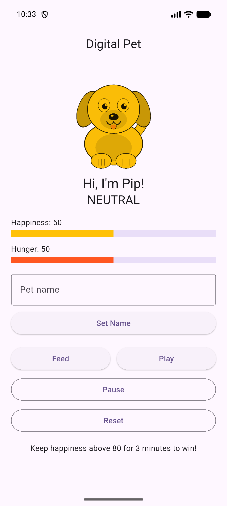
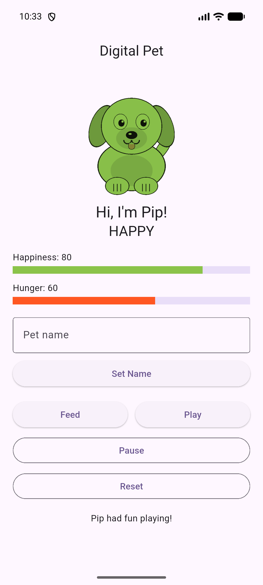
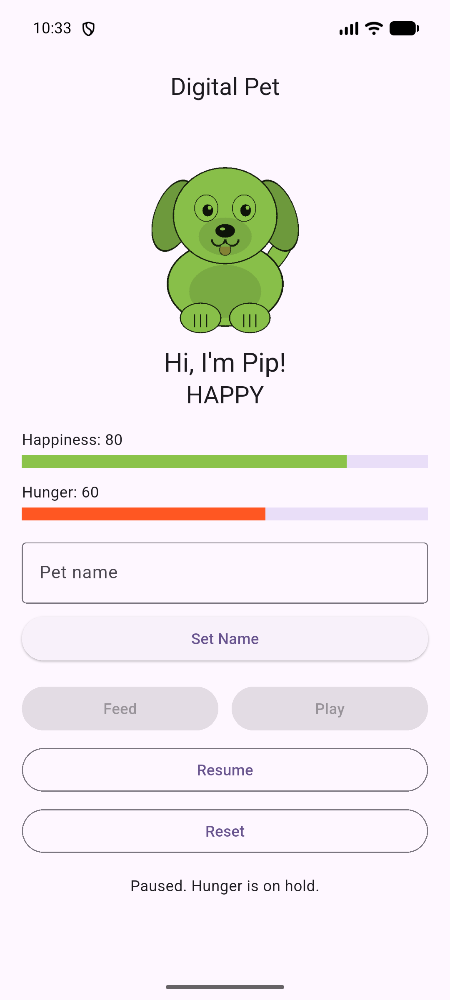

# Digital Pet

A Flutter virtual pet. Feed and play with your pet to keep it happy, watch its mood change its color, and try to keep it happy long enough to win.

## Setup

1. Install Flutter (stable channel) and an Android emulator or device.
2. Clone the repo and install dependencies:

   ```bash
   git clone https://github.com/Bsmith01cs/digital-pet-activity-07.git
   cd digital-pet-activity-07
   flutter pub get
   ```

3. Run the app with `flutter run`.
4. Build the APK with `flutter build apk --release`. The output is `build/app/outputs/flutter-apk/app-release.apk`.

## Pathway

Undergraduate pathway.

### Core requirements

- Editable pet name. The name is trimmed, and blank names are rejected.
- Happiness and hunger meters, each clamped to `0–100`.
- Mood text plus a `ColorFiltered` tint (`BlendMode.modulate`) on one pet image:
  - Green (Happy): happiness `> 70`
  - Yellow (Neutral): happiness `30–70`
  - Red (Unhappy): happiness `< 30`
- **Feed**: hunger −10, happiness +10. **Play**: happiness +15, hunger +5. **Reset**: restores the starting state.
- Hunger rises by 5 every 30 seconds. Going from 95 to 100 does not affect happiness. On any tick where hunger is already 100, hunger stays at 100 and happiness drops by 20.
- **Win**: happiness stays strictly above 80 for 3 minutes in a row. If it drops to 80 or below, the win timer is canceled.
- **Lose**: hunger is 100 and happiness is 10 or lower.
- After a win or loss, Feed, Play, and Pause are disabled until Reset.
- Every timer is canceled in `dispose()`.

### Advanced features

1. **Session Controls**: a Pause/Resume button.
   - **Pause** cancels the hunger timer and disables Feed and Play, so the meters cannot change while paused.
   - **Pause also cancels the win timer.** Paused time does not count toward the 3-minute win.
   - **Resume** starts a new 30-second hunger timer. If happiness is still above 80, a new 3-minute win timer starts **from zero**, because the win requires 3 *continuous* minutes above 80 and a pause breaks that streak.
   - Pause is disabled after a win or loss. Reset always clears the paused state.
2. **Visual Polish & Accessible Motion**:
   - `AnimatedScale` makes the pet bounce when it is fed or played with.
   - `TweenAnimationBuilder` animates the happiness and hunger meters smoothly.
   - When `MediaQuery.of(context).disableAnimations` is true (the system "remove animations" setting), all animation durations become zero and the bounce is skipped.

## Screenshots

| Neutral (yellow) | Happy (green) | Paused |
| --- | --- | --- |
|  |  |  |

## Tests

Run them with:

```bash
flutter analyze
flutter test
```

`test/widget_test.dart` uses fake time, so the 30-second and 3-minute cases run instantly. It covers:

- Mood and tint boundaries: happiness 29 → red/unhappy, 30 → yellow, 70 → yellow, 71 → green/happy
- Hunger and happiness never go below 0 or above 100
- Hunger rises by 5 every 30 seconds
- A tick from hunger 95 to 100 does not reduce happiness
- A tick while hunger is already 100 keeps hunger at 100 and reduces happiness by 20
- Happiness above 80 that drops back to exactly 80 cancels the win timer
- Happiness above 80 for a full 3 minutes wins, and the buttons are disabled
- Hunger 100 with happiness ≤ 10 loses, and the buttons are disabled
- Reset restores the original state
- Pause stops hunger, and Resume continues it
- Leaving the screen with timers running raises no `setState() called after dispose()` error
- Name trimming and blank-name rejection
- Animations are disabled when the system requests it

## Asset attribution

`assets/pet.png` is an original cartoon dog made for this project, so it needs no outside attribution. It has white fur, light-gray ears, and a transparent background so the `BlendMode.modulate` tint shows clearly.

## Git / PR evidence

I completed this project solo, so there were no teammates and no peer code reviews.

- Repository: https://github.com/Bsmith01cs/digital-pet-activity-07
- Pull request: https://github.com/Bsmith01cs/digital-pet-activity-07/pull/1
